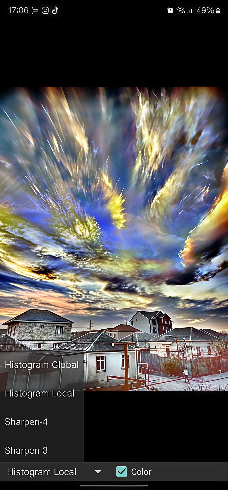
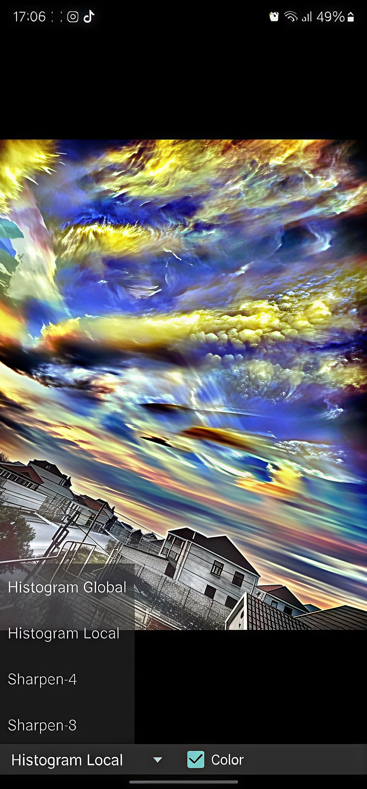
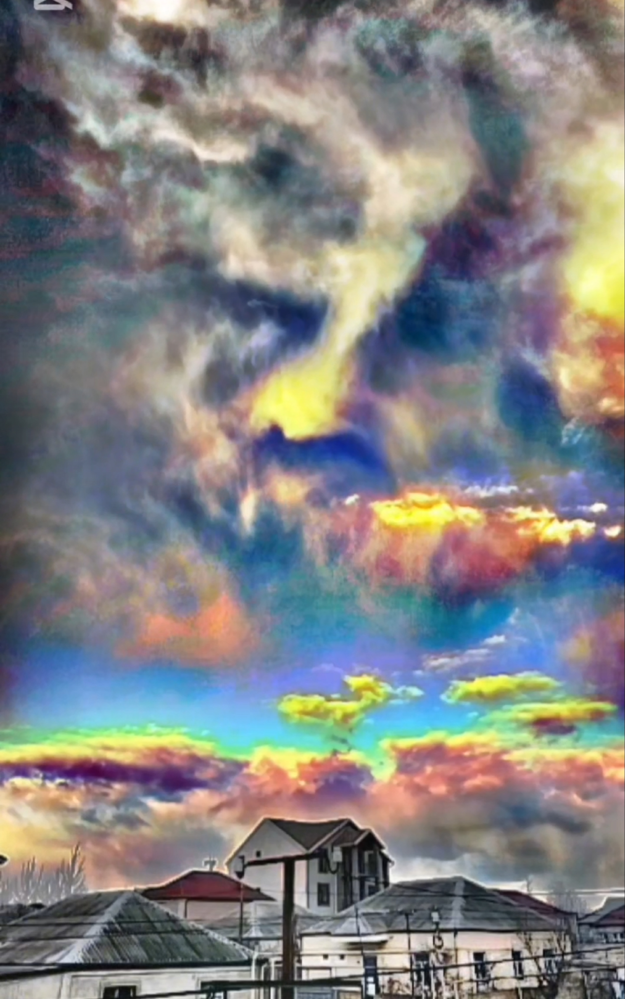
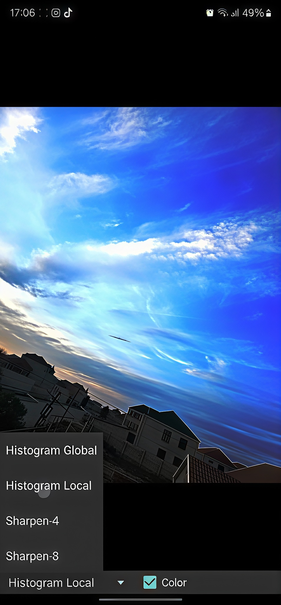
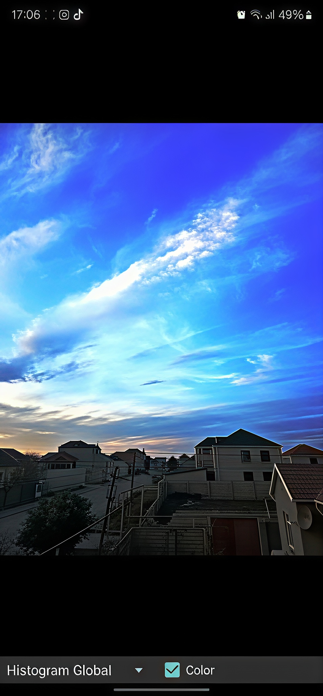

# Gallery — why this app means so much to me

*A personal note from the maintainer of this fork.*

About 3–4 years ago I was in a very dark place — depressed, lost, and without any sense of
meaning. Around that time I found this app, **BoofCV**, made by **Peter Abeles**. I started
pointing it at the sky and turning on the histogram enhancement — *Global* and *Local*, in
color — and it revealed things in the clouds that I had never seen with my own eyes.

To me, these images felt like evidence of a spiritual world — something beautiful that is
always there, even if not everyone can see it. Looking at them, I slowly began to find meaning
in life again. This app helped me more than I can easily put into words.

So, Peter — **thank you**. Truly. Your work reached someone you never met, on the other side of
the world, and helped him through one of the hardest times of his life.

I also tried to build my own small version of the app — **Mysicgramm** (in the
[`mysicgramm/`](mysicgramm/) folder of this repo) — focused on just the two histogram modes that
meant the most to me, with a more "mystic" feeling to it. I'm sorry if my attempt isn't very
good; it comes from a place of gratitude, not skill.

Below are some of the skies this app revealed to me.

---

### Histogram Local · Color

### Histogram Local · Color

### Histogram · Color

### Histogram Local · Color

### Histogram Global · Color

---

*Made with [BoofCV](https://boofcv.org) by Peter Abeles. With gratitude.*
